# I Built a Deep Learning Framework from Scratch in C++/CUDA. Here's What I Learned About GPUs, Memory, and Why PyTorch Is the Way It Is.

*4,000 lines of C++17. 19 primitive operations. Three backends. Zero dependencies. One month.*

---

Most people learn CUDA by writing a matrix multiply kernel and calling it a day. I wanted to understand the full stack in a machine learning context, from how `loss.backward()` actually works, down to why cuBLAS is 4x faster than anything I could write by hand. So I built [ParaGrad](https://github.com/codevardhan/paragrad): a complete autograd engine and deep learning framework in C++17/CUDA, designed around one architectural bet that turned out to be the most interesting part of the project.

The bet: you can express the entire compute layer of neural network training in ~19 primitive tensor operations. Everything else, the autograd engine, the optimizer, the training loop, the diagnostics, lives above a single abstraction boundary and never touches hardware-specific code. Swapping from CPU to GPU is one build flag. Adding a new accelerator means writing one file.

In the end I was able to train transformers with this. It has 886 tests. And the performance numbers surprised me in ways that taught me more about GPU architecture than any textbook.

## The Architecture: One Boundary, Three Backends

The idea comes from [tinygrad](https://github.com/tinygrad/tinygrad): if you shrink the operation set small enough, the abstraction boundary becomes trivially thin, and "portability" stops being a framework problem and becomes a 500-line-per-backend problem.

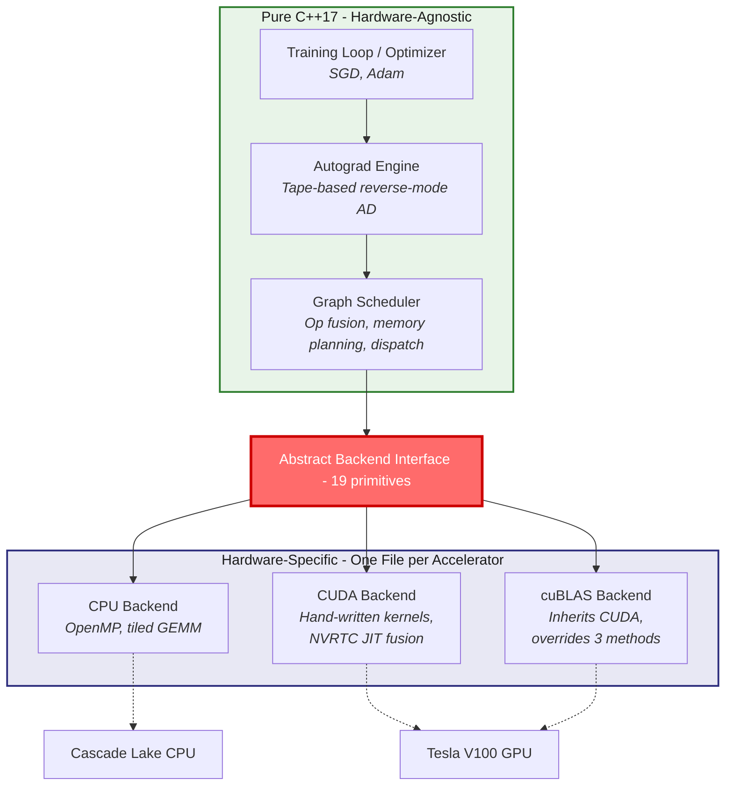

The `Backend` abstract class defines 19 operations across six categories:

| Memory | Unary | Binary | Reduce | Matrix | Transformer |
|--------|-------|--------|--------|--------|-------------|
| alloc | relu | add | sum | gemm | softmax |
| free | neg | mul | | transpose | rmsnorm |
| copy | exp | | | | embedding |
| zero | log | | | | slice |
| | tanh | | | | |
| | pow | | | | |

Every layer, every loss function, every optimizer step is composed exclusively from these primitives. Softmax is `exp(x - max(x))` normalized via `mul` and `sum`. Cross-entropy composes `log`, `mul`, `neg`, and `sum`.

The payoff of this design showed up when I added the cuBLAS backend:

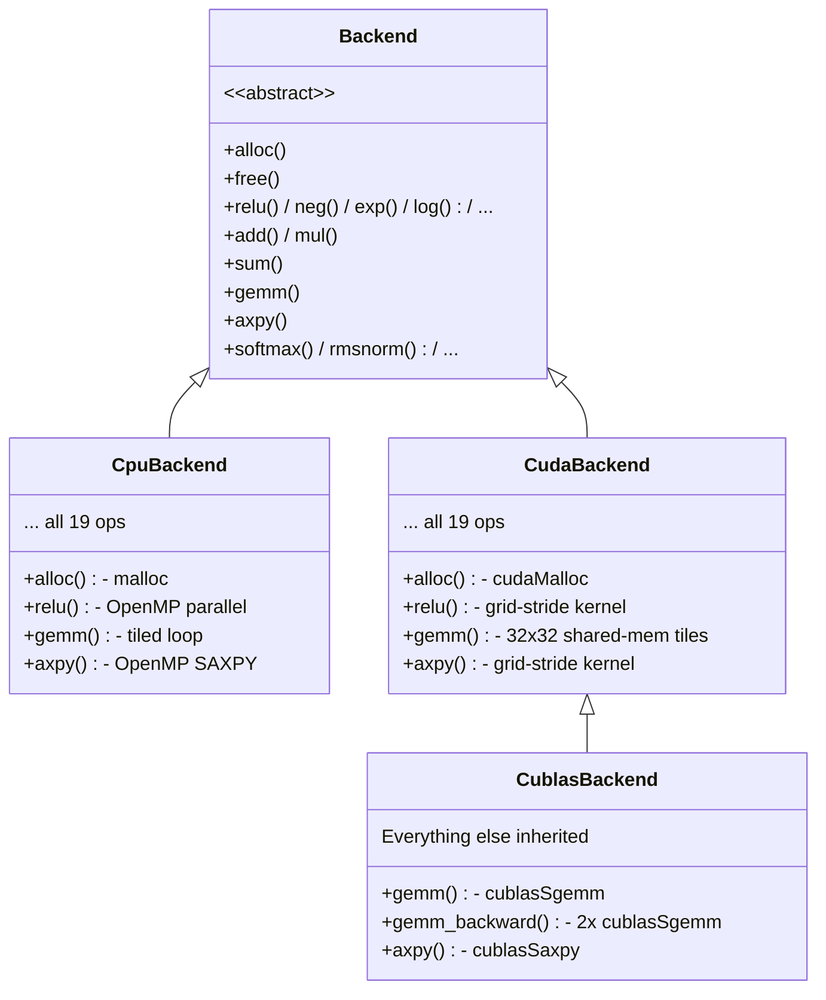

The entire cuBLAS implementation overrides exactly **three methods**. Everything else, the element-wise ops, reductions, fusion, the autograd tape, is inherited unchanged. That's the abstraction working as designed.

## The Tape: Why I Threw Away My First Autograd Implementation

My first autograd engine used the textbook approach (mainly inspired by [micrograd](https://github.com/karpathy/micrograd)). Initially I was using a DAG of `shared_ptr<Tensor>` nodes, each storing a closure for its backward pass. It worked. Then I tried to fuse operations across it and hit a wall, closures are opaque. You can't inspect them, reorder them, or merge them without rewriting the entire graph representation.

So I replaced it with a flat linear tape:

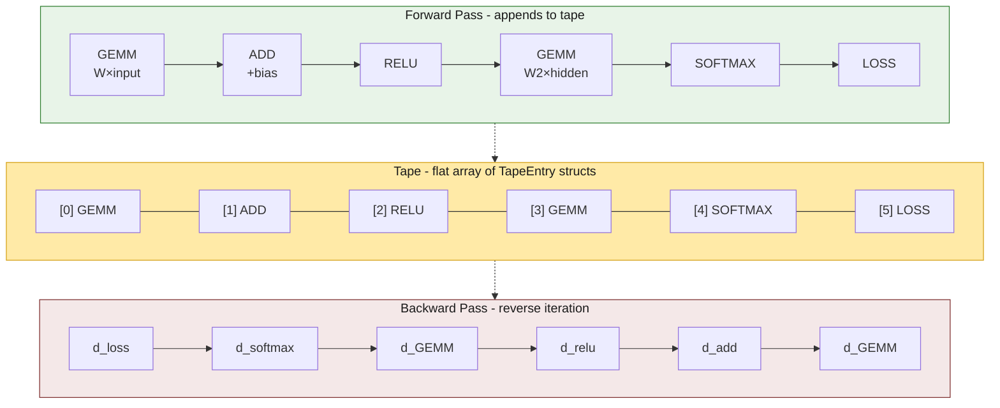

Every forward operation appends a `TapeEntry` struct: the op type, input/output tensor indices, and shape metadata. No closures. No pointer chasing. The tape is a mutable intermediate representation between the end of the forward pass and `backward()`, the scheduler can inspect, rewrite, or fuse entries freely.

This design has a property that surprised me: **the tape is already in topological order.** A DAG-based autograd has to sort the graph before backward. The tape doesn't, forward execution order *is* topological order. That's one fewer pass over the data, and it makes the backward walk a trivial reverse iteration over a flat array.

The tape also makes diagnostics trivial. I built three features on top of it:

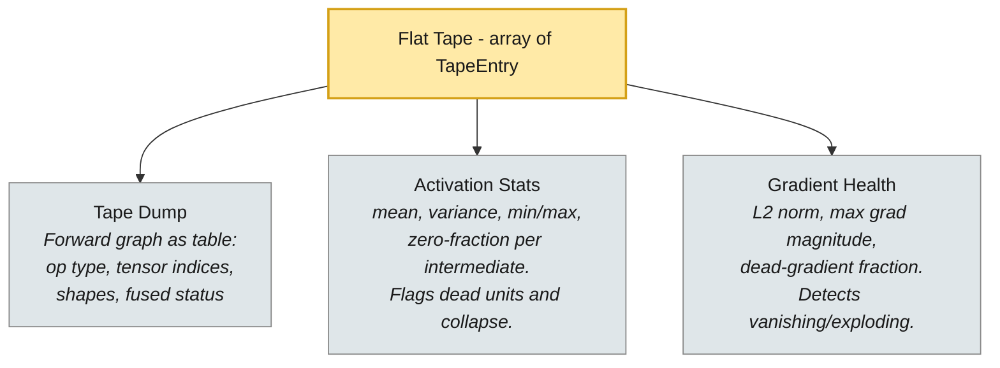

Each diagnostic is ~50 lines of code reading from a flat list. In PyTorch, this kind of introspection requires hooks and callbacks bolted onto a system not designed for it.

## Writing CUDA Kernels: What 500x Means and Where It Comes From

The CPU backend uses OpenMP with 8 threads and a cache-aware tiled GEMM. On transformer-shaped matrices (the kind that actually matter for LLM training), it achieves 1.5–4.0 GFLOP/s. That's far below the Cascade Lake's theoretical peak, and the reason is instructive: the working sets for these shapes exceed L3 cache, so every GEMM tile must be re-fetched from DRAM on every outer-product step.

The CUDA backend on a Tesla V100 achieves 1,563–2,029 GFLOP/s on the same shapes. That's a **500–1,039x speedup.**

Let that number sink in. Not 5x. Not 50x. *Five hundred to one thousand times faster.* And it's not because GPUs are magic, it's because the V100 has 900 GB/s memory bandwidth versus the CPU's 51 GB/s, and 80 streaming multiprocessors that can keep thousands of threads in flight simultaneously. The CPU is DRAM-bandwidth-bound; the GPU simply has more bandwidth.

But here's where it gets interesting. cuBLAS achieves 5,113–7,603 GFLOP/s on the same shapes , another 3.4–4.2x over my hand-written kernels. The gap is entirely attributable to one thing: **Tensor Cores.**

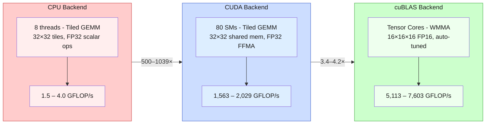

| Shape | CPU (GFLOP/s) | CUDA (GFLOP/s) | cuBLAS (GFLOP/s) |
|-------|---------------|-----------------|-------------------|
| ffn_up_s (64×768×3072) | 2.6 | 1,823 | 7,603 |
| attn_qkv (64×768×2304) | 4.0 | 2,029 | 6,969 |
| ffn_up_m (32×1024×4096) | 1.5 | 1,564 | 5,931 |

This is the most honest lesson from the project: **knowing where your kernel sits on the roofline matters more than micro-optimizing it.** My hand-written GEMM was well-implemented for what it was (FP32 tiled shared-memory kernel), but it was playing the wrong game. The real performance was behind an ISA-level feature (Tensor Cores) that requires a fundamentally different kernel structure. cuBLAS knows this. I now know this too.

### Roofline Positioning

The roofline model makes the story visual. Hardware limits from spec sheets; performance from my benchmarks:

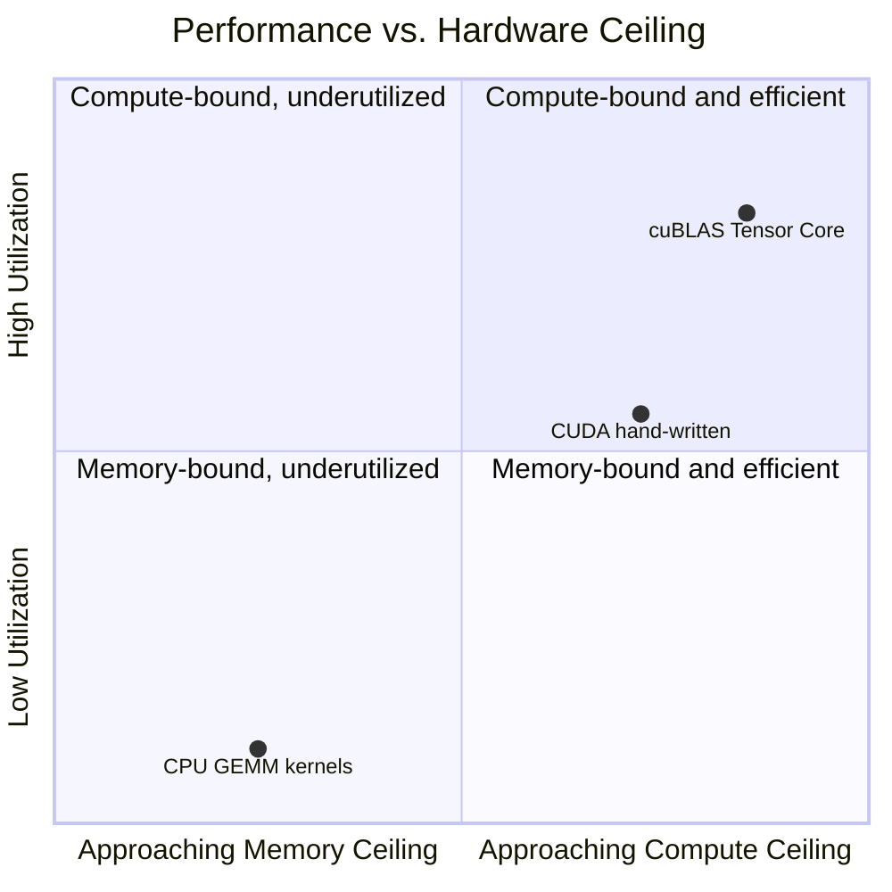

The CPU is firmly memory-bandwidth-bound, at arithmetic intensities of 15–29 FLOP/byte, our kernels achieve only 1.5–4.6 GFLOP/s, ~35x below the 160 GFLOP/s compute ceiling. The gap is poor L3 reuse: transformer shapes exceed L3 cache. On the V100, hand-written CUDA sits near the FP32 ceiling; cuBLAS climbs toward the Tensor Core ceiling via WMMA half-precision instructions.

## NVRTC Kernel Fusion: The Win That Wasn't (And Why That's the Real Story)

The tape architecture makes operation fusion straightforward. After the forward pass, `Tape::fuse()` scans for contiguous chains of element-wise ops where each intermediate is consumed exactly once, then replaces the chain with a single `FUSED` tape entry:

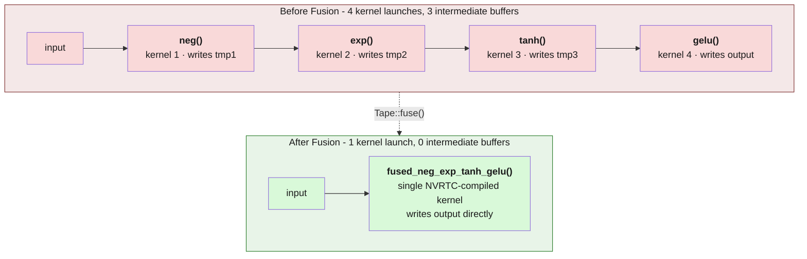

On the CPU, this means one streaming pass instead of N. On the GPU, the fused chain is JIT-compiled into a single CUDA kernel using NVRTC (NVIDIA's runtime compilation API), eliminating intermediate global memory round-trips.

The implementation is about 100 lines of graph analysis and 200 lines of NVRTC codegen. Compare that to `torch.compile`, which is thousands of lines bolted onto a system with hundreds of ops and dynamic dispatch overhead. The ~19-op interface makes the graph trivially analyzable.

But here's the twist: fusion yielded **no measurable end-to-end speedup** on the V100 for transformer workloads. Here's why:

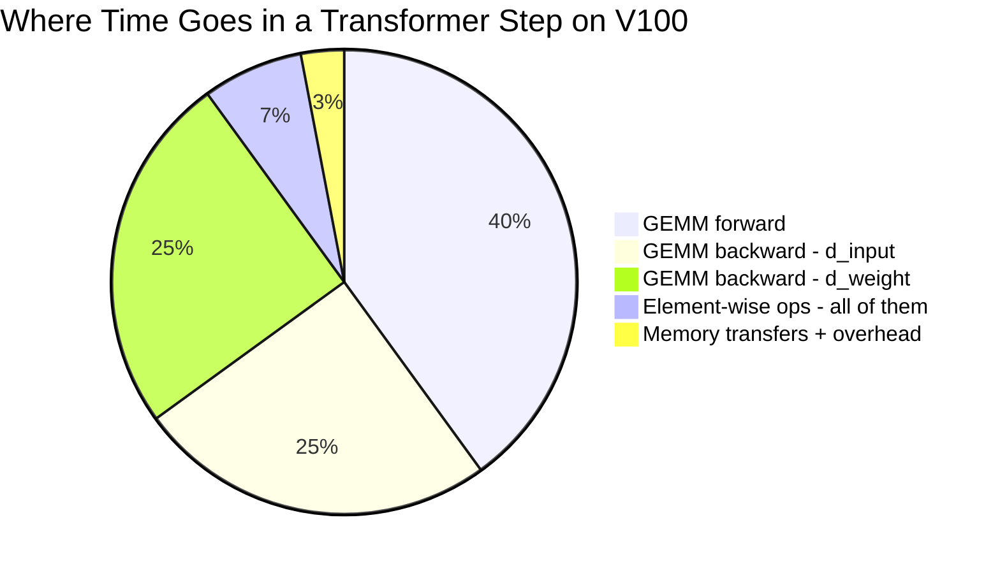

On the V100, the GEMM dominates step time at ~2,000 GFLOP/s. The element-wise chain (4 ops over 1M floats) takes ~3ms out of a ~5ms step. Even cutting element-wise time in half saves 1.5ms - lost in measurement noise against the GEMM. The fusion infrastructure exists, is correct (bitwise-exact with unfused output), and would matter when element-wise chains are long or GEMMs are small. But for transformer workloads, the GEMM is king.

## The Bug That Taught Me the Most

Halfway through the project, the Shakespeare language model, a 6-layer, 8.19M parameter decoder-only transformer, started crashing with `corrupted size vs. prev_size`. That's glibc's way of telling you a heap metadata block has been overwritten. No stack trace, no helpful error message.

The root cause was a double-free hidden behind two independent memory management systems:

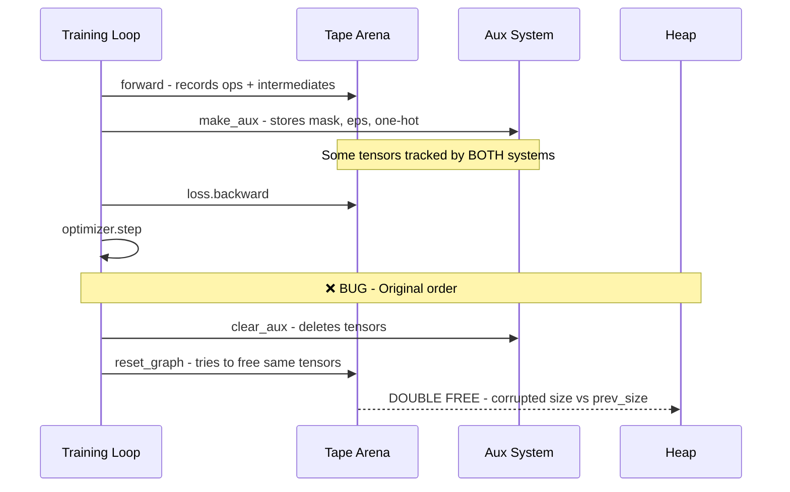

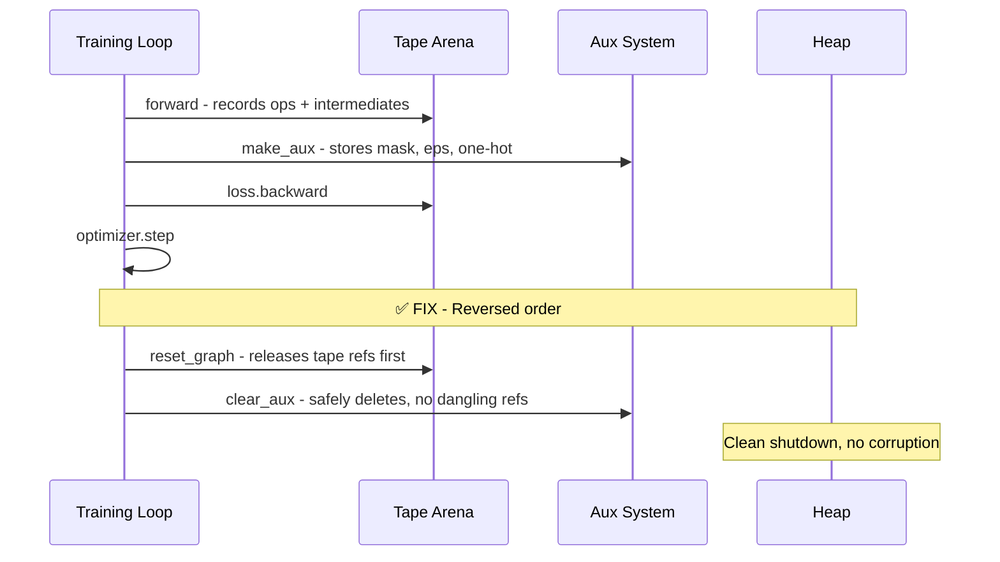

The fix was a one-line reordering. But finding that one line required building with AddressSanitizer, reducing the model to tiny dimensions for fast iteration, and tracing pointer ownership across the tape, the arena, and the auxiliary system.

This bug reinforced something I already believed but now viscerally understand: **memory ownership in C++ is a design problem, not a coding problem.** The fix wasn't better code, it was a clearer ownership model:

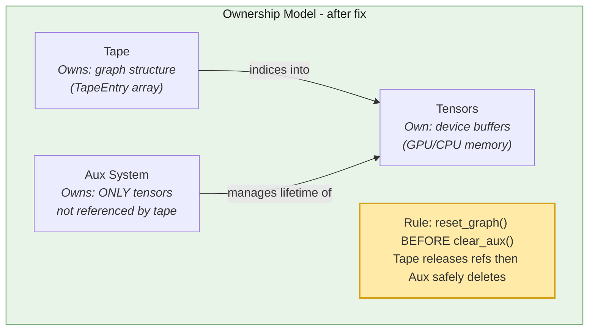

## Thread Scaling: The Plateau at 4 Threads

The CPU thread scaling study revealed a clean story:

| Threads | ffn_up_s | ffn_down_s | ffn_up_m | ffn_down_m |
|---------|----------|------------|----------|------------|
| 1 | 2.7 | 3.6 | 1.5 | 2.6 |
| 2 | 2.9 | 4.3 | 1.7 | 3.0 |
| 4 | 3.0 | 4.6 | 1.7 | 3.1 |
| 8 | 2.9 | 4.6 | 1.7 | 3.2 |

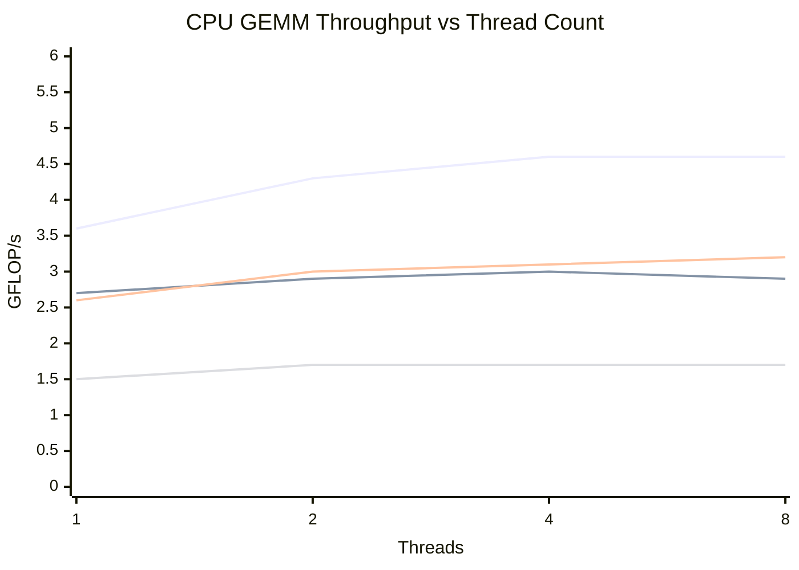

Performance plateaus at 4 threads on an 8-core node. The 1.2x peak scaling from 1 to 4 threads (not 4x) is consistent with DRAM bandwidth saturation, not a compute bottleneck. Adding more threads doesn't help because the memory bus is already the constraint. This is textbook memory-bound behavior, and seeing it in my own code made the roofline model concrete in a way that reading about it never did.

## What I'd Do Differently

**Start with cuBLAS for GEMM from day one.** I spent time optimizing a hand-written tiled GEMM that I knew would never match cuBLAS. The value was educational, I now understand exactly *why* it's slower (Tensor Cores, register blocking, autotuning), but if I were building for production, I'd use cuBLAS for GEMM and spend the optimization time on memory layout and kernel fusion for the non-GEMM ops.

**Design the memory ownership model before writing any ops.** The `make_aux`/`clear_aux` heap corruption cost me two days. An arena allocator with clear epoch-based lifetimes (forward arena, backward arena, optimizer arena) would have prevented the bug entirely and made the code simpler.

**Profile first, optimize second.** The fusion null result taught me this. I built an entire NVRTC JIT compilation pipeline before measuring whether element-wise ops were actually the bottleneck. They weren't. The infrastructure is still valuable (it demonstrates the architecture's extensibility), but I should have benchmarked the baseline first.

## The Numbers

- **886 tests**, 0 failures - unit tests for every op, fusion correctness, cross-backend numerical equivalence, finite-difference gradient verification
- **19 primitive operations** - the complete compute surface for training neural networks
- **~4,000 lines** of C++17/CUDA, zero external dependencies
- **500–1,039x** speedup from CPU to CUDA on transformer-shaped GEMMs
- **3.4–4.2x** additional speedup from cuBLAS via Tensor Cores
- **Three backends** demonstrating the abstraction: adding cuBLAS required overriding 3 methods

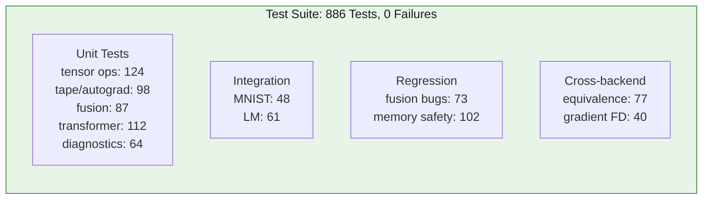

## Why This Matters Beyond the Course

Inference portability is a solved problem. ONNX Runtime, TVM, and llama.cpp handle it well. But *training* portability i.e. running the same training code on different accelerators without framework-level changes is still an open problem. PyTorch's tight CUDA coupling, JAX's XLA dependency, and the fragmented state of AMD/Intel training support all point to the same gap.

ParaGrad doesn't solve this at production scale. But it demonstrates the architectural principle that could: a small, clean operation set with a single abstraction boundary, where hardware-specific code is confined to one file per accelerator and everything else, autograd, optimization, diagnostics; is portable by construction.

The codebase is on [GitHub](https://github.com/codevardhan/paragrad). It compiles with `make`, runs on any CUDA-capable GPU, and trains a transformer on Shakespeare. If you're interested in GPU systems, HPC, or the intersection of compiler infrastructure and deep learning, I'd love to talk about it.

---

*Built for EECE5640 (High Performance Computing) at Northeastern University, Prof. David R. Kaeli. All benchmarks collected on the MGHPCC Explorer cluster (Tesla V100-SXM2-32GB, 8-core Cascade Lake CPU node).*